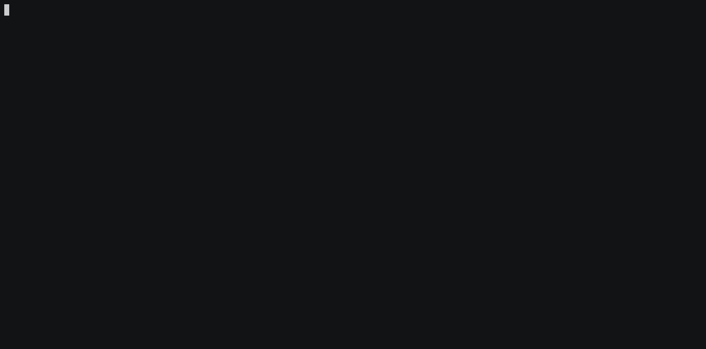

# Prop-rep

[](https://codeclimate.com/github/AlexsJones/prop-rep/maintainability)

A golang command line tool to show you which organisations are contributing to a repository.

Get the latest binary [here](https://github.com/AlexsJones/prop-rep/releases/)



```
prop-rep scan -r prometheus/prom2json -v
17 contributors found
This will take a while...
17/17 Users scanned
24 unique organisations found
Organisation             Contributors  Users
prometheus               6             beorn7, SuperQ, simonpasquier, juliusv, discordianfish, roidelapluie
FOSDEM                   1             SuperQ
open-cluster-management  1             chaitanyaenr
voxpupuli                1             roidelapluie
noisetor                 1             SuperQ
```

## Dependencies

Generate a Personal Access Token at [https://github.com/settings/tokens](https://github.com/settings/tokens) which needs the `read:org` scope. Use this token as `GITHUB_TOKEN` environment variable, which is required to access the GitHub API.

## Releasing

This project uses `goreleaser` to release a new build `goreleaser --rm-dist` after creating a new local tag
